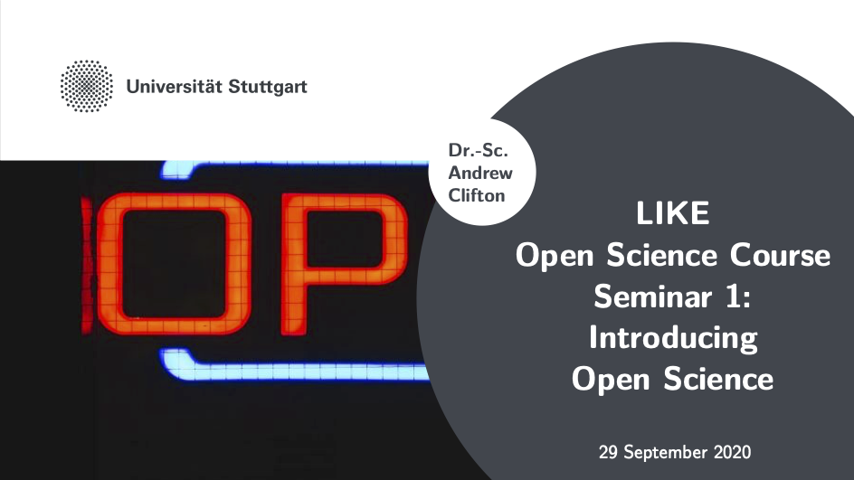

# Seminar 1: Introducing Open Science
Led by Andy Clifton, U. Stuttgart [ https://orcid.org/0000-0001-9698-5083](https://orcid.org/0000-0001-9698-5083)

This is the script of Seminar 1, based on the first course held in September 2020.

This document is based on notes from the seminar. The seminar was held online and was limited to 9 participants. This allowed for discussion between the participants. Participants were encouraged to use video to help enable interaction and questions.

## 1. Introductions

We took 5 minutes to introduce ourselves.

## 2. The LIKE open science course

We started by discussing what open science might be, and why we would be aiming to develop a mindset rather than providing clear-cut solutions. We then looked at a definition from wikipedia.
     
> Open science is the movement to make scientific research (including publications, data, physical samples, and software) and its dissemination accessible to all levels of an inquiring society, amateur or professional. Open science is transparent and accessible knowledge that is shared and developed through collaborative networks. It encompasses practices such as publishing open research, campaigning for open access, encouraging scientists to practice open-notebook science, and generally making it easier to publish and communicate scientific knowledge.  - [Wikipedia](https://en.wikipedia.org/wiki/Open_science)

Open science is a concept. It is not something concrete; rather, it is a philosophy or a mindset and a set of goals that we can strive towards. There are very few correct answers, and so this course sets out to provide the participants a toolbox that they can then apply to their own work.

A little thought will tell you that open science must quickly create a tension with our current ways of doing things. For example, can we make the knowledge behind commercial products "open"? Will management recognise and reward the effort required to make data be open? And how do we communicate our science to the people that might use it? The course will explore these and related questions.

## 3. Let's talk about COVID-19

We (the seminar organisers) chose to discuss COVID-19 because it is a great example of something scientific that we have all experienced.
    
Before starting this discussion we reminded the participants that there was no need to share personal information.
    
### How did we learn about COVID-19?

This part of the seminar started with a discussion of how we all learned about COVID-19.

- Some participants in the course found information about pandemic online through news media, for example the BBC, CBC or other well-established news outlets. This seems to be considered "trustworthy" news, but there was also agreement that it was a good idea to cross-check news sources. Also, it was felt helpful to go to well-respected international medical news sources such as the WHO to get the original story.
- Twitter was also mentioned as a news source, but it was noted that here it was important to find reputable people or organisations to follow.
- Baidu, wechat, and WhatsApp were also mentioned as news sources, particularly in China and Asia.

The course participants all felt it important to crosscheck news sources against each other, or the original source. Some people noted that it was hard to find out what the source of information really was.

Almost everyone had seen information posted on social networks like Reddit or Facebook but felt that the information content was low and that they were not  good sources of reliable news.

### Did we get involved with any activities to respond to COVID-19?

As the COVID-19 pandemic spread and affected more people, a lot of people volunteered their time and skills to respond. A lot of these initiatives were local, for example delivering food to patients in risk groups, but there were also virtual responses, such as the [COVID-19 tech handbook](https://coronavirustechhandbook.com/).

In the discussion in our first seminar in October 2020, no-one reported getting directly involved with the reponse to COVID-19. Several people said that they would have liked to, but were unable to find out how they could contribute or what was needed.

It sometimes takes a lot of effort to find these initiatives. It is easier to find these initiatives if they do a bit of advertising, for example through social media.

This challenge speaks to the need to make science discoverable, which is enabled by good communications, and repositories with good metadata. For some examples of solutions to this for COVID-19 see e.g. the [Crowdfight COVID-19 initiative](https://crowdfightcovid19.org/) or the COVID-19 community on Zenodo.org. We'll discuss some possible solutions to this in later seminars.

### Did openness help?

Openness around COVID-19 helped establish facts that could then be acted upon. Openness was not always implemented well, though. There is a lot of information in circulation, and it is hard to tell what is current. Also, some of the communications and visualisations were poor or confusing. Together this has sometimes led to information overload or fatigue.

_Source: [XKCD](https://xkcd.com/2294/). Used under the [CC-BY-NC 2.5 license](https://creativecommons.org/licenses/by-nc/2.5/)._

## 4. Summary
Open science is a movement and a philosophy. A willingness to be open and try new approaches to collaboration has had dramatic impact on our response to the COVID-19 pandemic. However, challenges remain with finding data, understanding its origins and limitations, and acting on that information.

---

## For more information
- See [the notes from the next seminar on the guiding principles of open science](../01_seminar1/notes/readme.md).

## Course Progress
| Previous: This is the first event in the course. | [Course outline](../../readme.md#course-outline) | Next: [Self-study 1: "Background reading"](../../02_selfstudy1/readme.md) |
|---|---|---|
