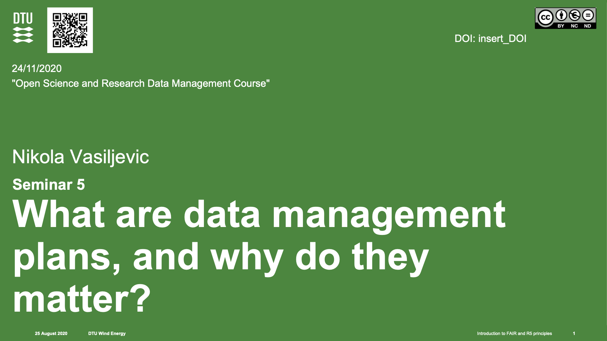

_The seminar was led by Nikola Vasiljevic, DTU [ https://orcid.org/0000-0002-9381-9693](https://orcid.org/0000-0002-9381-9693)_

# Seminar 5: What are data management plans and why do they matter?
Notes written by Andy Clifton, U. Stuttgart [ https://orcid.org/0000-0001-9698-5083](https://orcid.org/0000-0001-9698-5083)

## What is a data management plan?

A data management plan or DMP is a formal document that outlines how data are to be handled both during a research project, and after the project is completed.

The goal of a data management plan is to consider the many aspects of: 
 * data management
 * metadata generation
 * data preservation
 * and analysis before the project begins

This ensures that data are well-managed in the present, and prepared for preservation in the future.

N.B. Data should be taken to mean data _per-se_ as well as code!

## When should you write a data management plan?
You should write a DMP for every new project that will generate data.

You should also consider writing a new data management if you initiate a major data-generating phase; your project may have changed since you wrote your project plan, or the options that are open to you - e.g., data management websites - might change as well.

It's also a good idea to review your DMP every year or so. You might have forgotten something you said you would do!

## How to write a data management plan

There are lots of ways to write a data management plan. We suggest using [DMPonline](https://dmponline.dcc.ac.uk/), provided by the UK Digital Curation Centre (DCC). This website provides a template for a DMP that meets most funding agency's requirements but is also quite simple. This has been chosen for ITN LIKE because it meets the needs of the funding agency.

There are other services, for example [DataWiz](https://datawiz.leibniz-psychology.org/DataWiz/). You may be required to use this or another service by your funding agency.

### Metadata
Most DMP include a lot of metadata about the researcher and project. This could include the researcher's organisation, ORCID id, and other identifying information, It could also include funding agency and grant number. The metadata would allow a well-constructed portal to pull other data using that information; for example, if the researcher gave their ORCID id, that information could be used to pull the researcher's name, organisation, etc.

### Allowing access
Some online DMP tools allow you to give others access to a DMP so that they can provide feedback. You should probably give your supervisor access to it, but you should also give access to you colleagues as well so that they can provide feedback.

### The project data management plan content
You will then want to start thinking about the content of your DMP. Usually the template or tool that you use will prompt you to enter information about your data and think about what you are going to do with that. It usually includes things like...
- activities that will generate data
- the types of data
- amount of data
- licensing and intellectual property needs
- how data will be published or shared.

## Publishing the DMP
You DMP is a publication, but you won't be publishing it in a journal. Instead, you can publish it through a University library, Zenodo, or other data repository. 

As with any other publication you'll get a DOI that you can then reference in future. See, for example, an example data management plan from Pedro Santos (DTU) [on Zenodo](https://zenodo.org/record/4009127) for his PhD.

## Updating the DMP
You may want to update your DMP in 6 months' time. You could do this by creating a new publication where-ever you submitted your first version. Alternatively, if you used Zenodo, you can just [add a new version to your existing publication](https://help.zenodo.org/#versioning). 

## Summary
Data management plans are a tool to help you think about your data. They help you take a long-term, coordinated perspective and consider how your data will be useful in future.

## License
These notes are published under the [Creative Commons CC BY 4.0 license](https://creativecommons.org/licenses/by/4.0/)

---

## Seminars in this course
- Seminar 1: [Introducing Open Science](../../01_seminar1/notes/readme.md).
- Seminar 2: [Guiding principles](../../03_seminar2/notes/readme.md).
- Seminar 3: [Open Science and Intellectual Property](../../05_seminar3/notes/readme.md).
- Seminar 4: [Communications strategies](../../07_seminar4/notes/readme.md).
- Seminar 5: [What are data management plans and why do they matter?](../../10_seminar5/notes/readme.md).
- Workshop: [Case studies in open science](../../12_workshop1/notes/readme.md).

## Course progress
| Previous: [Assignment 1: Implementation Case Study!](../../09_assignment1/readme.md) | You are here: [Seminar 5: What are data management plans and why do they matter?](../readme.md) | Next: [Self-study 5: Draft your data management plan](../../11_selfstudy5/readme.md) |
| -- | -- | -- |
