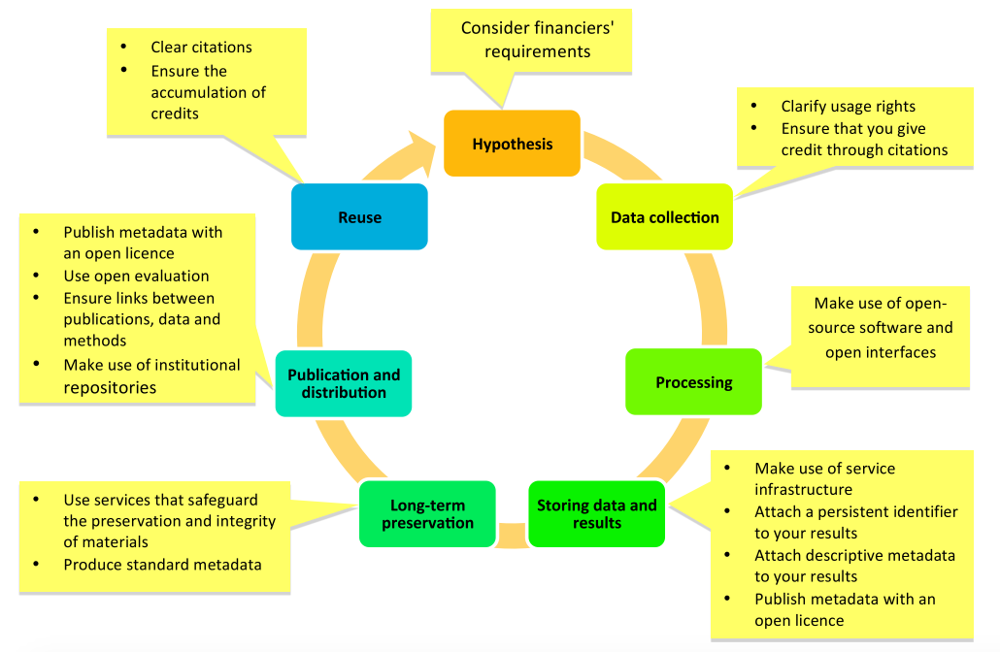
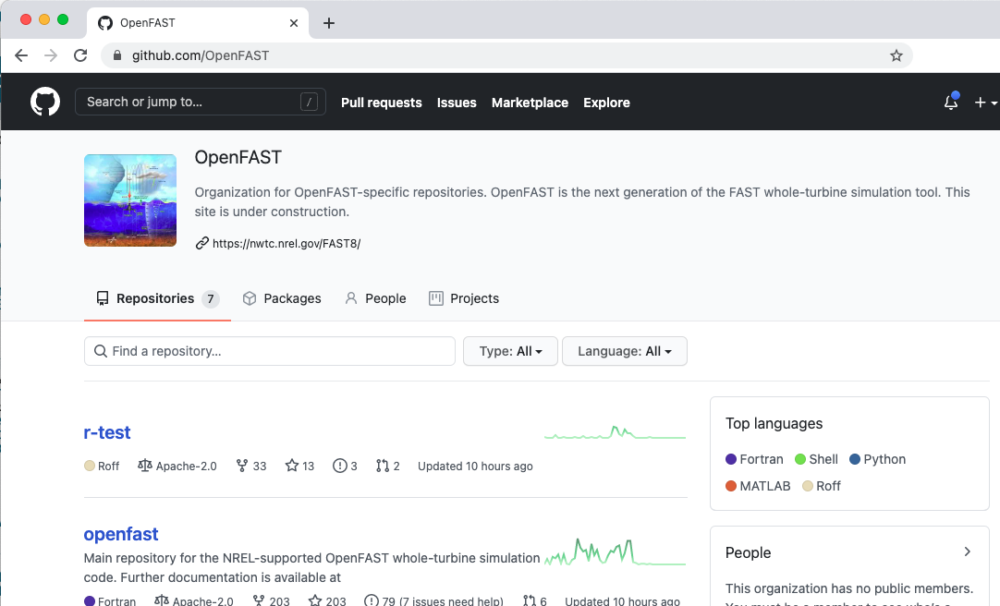
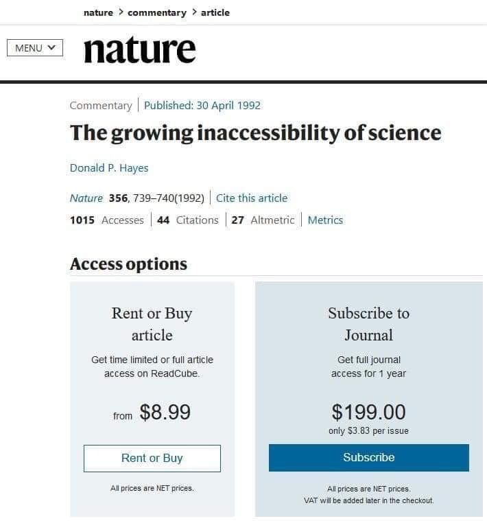
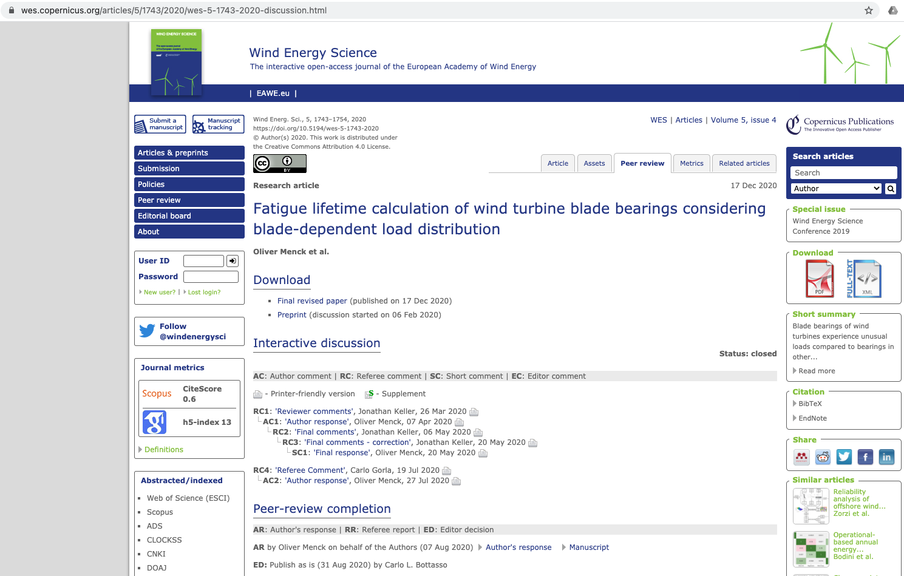

# Workshop on experiences with open science

_These notes are based on the experiences of the students and leaders of the 2020 ITN LIKE open science course and may go beyond the material discussed in the workshop itself._

This course has concentrated on the philosophy and mechanics of open science as they apply to early-stage STEM researchers involved in research projects ([Figure 1](#fig:open-science-activities)). We've discussed:
- [Open data](#sec:open-data)
- [Open source](#sec:open-source)
- [Open access](#sec:open-access)
- [Open notebooks](#sec:open-notebooks)
- [Open peer review](#sec:open-peer-review)
- [Communications and social networks](#sec:communications)
- [Data management plans](#sec:data-management-plans), and
- [The problems](#sec:problems).

Although these notes are based on the experiences of around 20 participants in our first course, we hope they may be broadly applicable and helpful for any STEM researcher.

_Figure 1. Open science activities during a typical R&D project process ([FOSTER](https://www.fosteropenscience.eu/content/what-open-science-introduction))_

 ## Open data 
Projects use a mixture of new and old data. 

Around half of the participants in the course in 2020 were actively creating new data sets that would be completely open and implement FAIR data principles (See notes from [Seminar 2](../../03_seminar2/notes/readme.md).
). The rest of the participants were setting up data sets that would be restricted, but planning on publishing metadata for the data sets. Such steps will directly support their own science and also enable future research.

Awareness of the challenges with data rights, and the need for clear licensing, was prompting participants to investigate and solve these challenges early in their projects. It was noted that in older projects, publishing was only considered at the end of the project and as result license concerns often prevented data collection; had this been considered earlier, the data might be available.

It is also clear that there is a change taking place in many STEM disciplines. It was noted that data is often difficult to find for papers published before 2015, and impossible to find for papers from 2010 or earlier.

Participants felt that was often relatively easy to make data open using [Zenodo.org](http://www.zenodo.org), University or organisational repositories, journals, or application-specific repositories. All of these had well-developed metadata schemas.

Even when data are completely restricted and metadata cannot be made open externally, employers see the benefit in applying open science approaches to help make data FAIR internally. 

However, challenges remain in creating open data sets.
- One challenge was the lack of a playground to test these repositories in advance. Zenodo has implemented a "sandbox", but this is not easy to find and similar spaces to learn by doing are not often found on other repositories.
- Another problem was the lack of common keywords. This is being mitigated by the development of application-specific ontologies (e.g., [for wind energy](http://data.windenergy.dtu.dk/ontologies/view/wtax/en/) or [for wind lidar](http://data.windenergy.dtu.dk/ontologies/view/IEATask32Glossary/en/)), but these still need to be linked to the repositories so that users can choose from these lists.
- In some STEM fields it is common to work with data that includes personal information. The [Amnesia](https://amnesia.openaire.eu/index.html) tool was developed to speed up the process of anonymization for such cases.

## Open source
Most of the participants in the workshop had some experience with writing or using open source code. This was often made available through GitHub, but others were developing code and publishing it through language-specific repositories such as [PyPi (for python)](https://pypi.org/) or CRAN [(for R)](https://cran.r-project.org/), allowing code to be used as packages.

It was noted that modular frameworks -- a set of modules connected together with clear inputs and outputs, potentially as part of a model chain or data analysis chain -- were very useful. The wind turbine simulation tool [OpenFAST](https://github.com/openfast) ([Figure 2](#fig:open-fast)) was frequently mentioned as an example of this.

_Figure 2. The OpenFAST wind turbine simulation tool is often seen as an excellent framework for scientific collaboration. Source:  [github.com/OpenFAST](https://github.com/OpenFAST)._

One challenge that was discussed was the tendency of scientists and engineers to wait to publish code until it is complete. It was noted by several people that **"done is better than perfect"**, i.e., there is a benefit to getting code out for people to use sooner, rather than later. Publishing code sooner makes it easier to find collaborators and allows the code to be modified to meet user needs.

Open source code development was also often associated with **agile project management**, which can also be seen as goal-oriented development with short cycle times fo a few weeks to months (sprints). This focus on outcomes instead of process often leads to a more productive effort. Open-source code is well-suited to agile project management because it provides a way for groups to cooperate and collaborate, despite often being separated by significant distances and bringing different skill sets.

In general it was noted that open source code would probably become more popular because it is easier to build upon, and shortens the time required for an experiment or reduces the time required for analysis.

Open source software can now be "published", i.e., received a DOI and become citable. This can be done through Zenodo but also specific journals, such as _[The Journal of Open Source Science (JOSS)](https://joss.theoj.org/)_ which also have open review and allow open access.

## Open access 

Everyone in our workshop had experience of using open access materials. For some participants this had been the only way they were able to access research before starting at a European university, as they did not have access to papers that were behind paywalls ([Figure 3](#fig:open-science-activities)).

_Figure 3: Oh, the irony! Behind a paywall until early 2020, this paper is now available at no cost. [DOI: 10.1038/356739a0](https://doi.org/10.1038/356739a0)_

Many funding agencies now require open access publishing. Although this can be more expensive than traditional publishing at a journal, these costs may be offset by funds available through the authors' organisations.

Participants in the workshop expressed clear preference toward making their own material open access as far as possible. It is likely that an open access policy will become normal across STEM journals in the near future as paywall-protected journals lose readership and authors.

## Open notebooks
Digitalisation of lab notebooks is often overlooked but can be a vital part of ensuring that data can be reused. Notebooks can be scanned and saved as images, or converted into machine-readable data files. Notebooks can be saved in the same repositories as other data.

One participant in the workshop noted that they still had the paper notes from experiments that they had carried out over a decade ago. However, these notes were not accessible and there was no metadata about their existence, making them essentially worthless.

Another participant, inspired by the course, had scanned their experiment notes as PDFs and uploaded them to a subject-matter repository.

The recent COVID pandemic has demonstrated the value in having scanned notes that are available anywhere, anytime, to anyone. A Nature technology feature noted in September 2020 that:

> For [a new researcher], scanning old lab notebooks has provided an unexpected benefit. He’s new to the group, having started in February, just before the pandemic closed his lab. Reading through them has revealed insights that he might not have got from the team’s papers.

_Source: How to digitize your lab notebooks. Nature (28 September 2020). [DOI: 10.1038/d41586-020-02728-0](https://doi.org/10.1038/d41586-020-02728-0)_

## Open peer review
A few journals have now adopted open review processes. Examples include the Wind Energy Science journal. Although few of the participants in the course have published papers so far, almost all said that they would be interested in contributing to a journal that used open peer review. Reasons varied, and included:
- Alignment with their own values as authors
- Constructive feedback instead of adversarial feedback
- More balanced feedback instead of reviewers seeking to raise their own citations
- Speed of reviews
- Ability to learn by reading reviews of other papers.

It would be possible to take the existing peer review process - whereby reviewers are selected by the editors - and have a pseudo-open review process where those reviews are published. Some journals have extended the open peer review concept to be an interactive, open discussion about the paper in question where potential reviewers are invited to review, but anyone who is interested may contribute ([Figure 4](#fig:open-review)).

_Figure 4. The open review process enables transparent and constructive review. An example of the most recent paper published by the journal "Wind Energy Science". [DOI: 10.5194/wes-5-1743-2020](
https://doi.org/10.5194/wes-5-1743-2020)_

## Communications and social networks
The participants in the workshop had taken a range of approaches to communicating their science. They had adopted different and specific approaches to making people aware of their work and allowing them to act on it. Examples included:
- promoting it through social media
- conference presentations
- internal presentations
- developing websites
- sharing links to repositories
- deliberate "calls to action" designed to achieve a specific goal.

Some of the participants noted that deliberately creating and executing a communications strategy (see [Seminar 4](../../07_seminar4/notes/readme.md)) did not require much time, but led to higher impact than they expected.

Scientific social networks are [an essential part of communicating science]((../../07_seminar4/notes/readme.md)). They allow scientists to target each other and facilitate the exchange of information.

Only one purely scientific social network was well known. [ResearchGate](http://www.researchgate.net) was founded in 2008 and has achieved some network effects, with around 20 million users in 2020. Although some participants found ResearchGate a useful resource, other participants said that they preferred to use larger social networks and leverage their tagging and community / group functionality to find and share material.

The two most commonly mentioned networks were Twitter and LinkedIn. As was noted in [the first seminar in this course](../../01_seminar1/notes/readme.md), network adoption can vary depending on location and in some communities WhatsApp, WeChat and other apps or platforms might be more relevant.

## Data management plans - helping think it through
During the course the concept of a data management plan was introduced (see [seminar 5](../../10_seminar5/notes/readme.md).
). They were felt to be a helpful tool for planning activities as they prompted thinking in advance about the products of the research, and how they could be used. It was also noted that they do not need to be complex or long to be useful.

## What are the problems with Open Science?
Although this course has focussed on the benefits of open science, it is clear that there remain some problems with open science.

- It is a change from the established order and threatens business models.
- It is a philosophy and not easy to teach in traditional settings.
- Adopting it requires clear guidance. To support this we are developing a set of [use cases and case studies](../../99_resources/01_case_studies/readme.md) that we will add to over time.
- The efforts that people put in to making their science may not be recognised by their employers.
- It can take time for the results of adopting open science to be clear.

However, these challenges were all felt to be small compared to the legal challenges, particularly:
- choosing and using a license for data or publications,
- the need to agree Non-Disclosure Agreements (NDAs) or other usage agreements to access restricted data,
- and the lack of common understanding between legal experts and STEM experts.

Some of these legal challenges arise because it is not always clear to a legal team that openness and open science is aligned with an organisation's interests. Therefore, these challenges may be mitigated as it becomes clearer that open science _is_ aligned with an organisation's interests. Legacy restrictions (i.e, not open science) may remain problematic, but will be rendered irrelevant by new developments that are open.

## Summary
Adopting open science can bring many benefits to STEM researchers. It can be implemented using a few simple ideas, processes, and tools that are compatible with academic research and industry users and are applicable to open and restricted data. Because open science may be a change from typical behaviour it is easiest to implement when it is planned in from the start of a project. 

Many of the challenges that are currently found in implementing open science approaches will be mitigated as organisations and people see the benefits of open science.

## License
These notes are published under the [Creative Commons CC BY 4.0 license](https://creativecommons.org/licenses/by/4.0/)

---

## Seminars in this course
- Seminar 1: [Introducing Open Science](../../01_seminar1/notes/readme.md).
- Seminar 2: [Guiding principles](../../03_seminar2/notes/readme.md).
- Seminar 3: [Open Science and Intellectual Property](../../05_seminar3/notes/readme.md).
- Seminar 4: [Communications strategies](../../07_seminar4/notes/readme.md).
- Seminar 5: [What are data management plans and why do they matter?](../../10_seminar5/notes/readme.md).
- Workshop: [Experiences of implementing open science](../../12_workshop1/notes/readme.md).

## Course progress
| Previous: [Self study 5: Draft your data management plan](../../11_selfstudy5/readme.md) | You are here: [Workshop: Case studies in open science](../readme.md) | Next: [Self-study 6: Revise your data management plan](../../13_selfstudy6/readme.md) |
| -- | -- | -- |
