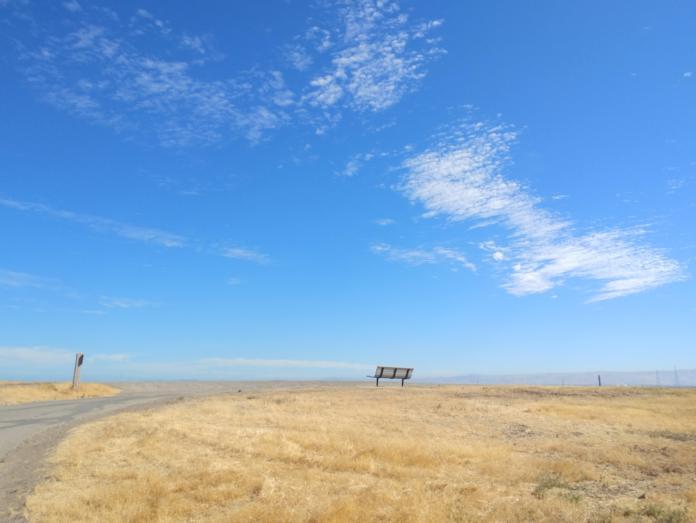

% Seminar 1: Introducing Open Science
% Andy Clifton
% date TBD

# Welcome!

---

## Introductions

Who's on the call?

---

## About this course

Our goals:
- To educate ESRs about modern approaches to open science data management
- To enable and motivate ESRs to implement these approaches in their projects

For more information, see the [LIKE-ITN GitHub repository](https://github.com/LIKE-ITN/OpenScienceTrainingCourse).

---

# Open Science in LIKE

---

## What is Open Science?

---

# Let's talk about COVID-19

---

## How did we learn about COVID-19?

:::::::::::::: {.columns}
::: {.column width="50%"}

{width=100% height=100%}

:::
::: {.column width="50%"}

- Bullet
- Bullet
- Bullet

<!-- 100% of this column, that is -->

:::
::::::::::::::

+ is there a lesson learned for scientific information?

---

## How was information shared?

---

## How was information published?

---

## Does openness have disadvantages?

---

# Acknowledgments

+ These slides were created from markdown and processed on GitHub using Pandoc.
+ The slides are based on an example by Peter Conrad, available at http://www.peterconrad.com/markdown/slide-templates/.

---

# Next events

+ **Self study 1:** Background reading (https://github.com/LIKE-ITN/OpenScienceTrainingCourse/blob/master/selfstudy1.md)
+ **Seminar 2:** Guiding principles (https://github.com/LIKE-ITN/OpenScienceTrainingCourse/blob/master/seminar2.md)

## Self study 1: Background reading

See resources in the LIKE Open Science Training Course GitHub repository